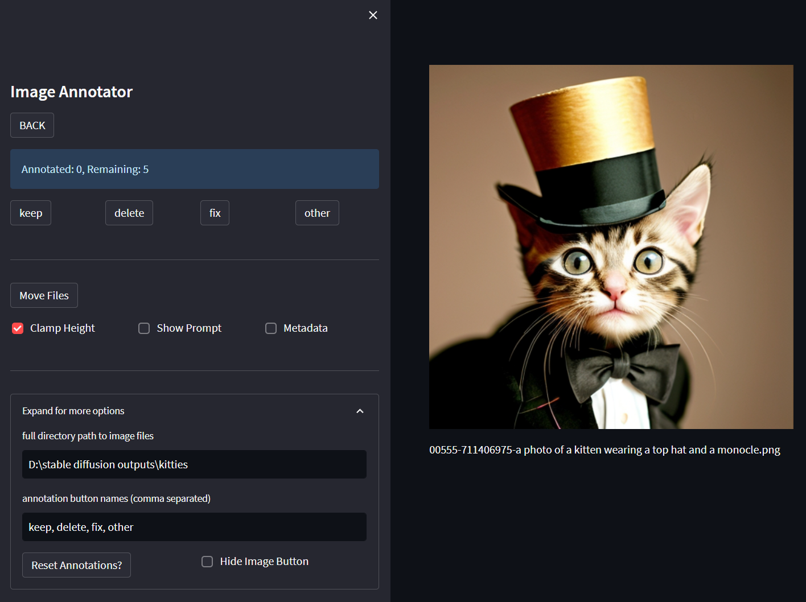

<div align="center">
    
<p>An annotation tool to sort through images, useful when generating a lot of images with Stable Diffusion. This image was modified with ControlNet.</p>
</div>

## Table of Contents

* [Introduction](#introduction)
  * [Category Sorting](#annotation-and-file-sorting-using-category-buttons)
  * [Keyword Sorting](#bulk-file-sorting-using-keyword-filters)
* [Installation](#installation)
* [Project Structure](#project-structure)
* [Config](#config)
* [Using the App](#using-the-app)
  * [App Demo](#app-demo)
* [Development](#development)
* [Future Work](#future-work)

# Introduction

<div align="center">
    
    <p>Image Annotator interface.</p>
</div>

This tool is helpful to sort images. A good use-case is when generating images with Stable Diffusion, it is possible to batch generate a lot of images. You might want to sort them, and looking at them in a file explorer is difficult if you cannot see the whole image.

## Annotation and File Sorting Using Category Buttons

__Example:__

You generate 50 images with a prompt like "a photo of a kitten wearing a top hat and a monocle".

When looking at the resulting images you might want to organize them into categories like "keep", "delete", "fix", where the "fix" option could be so you can inpaint to fix any details. Maybe your kittens have funny paws?

This app gives you a UI to go through images and organize them into different categories, where you can move them into folders for easy organization.

## Bulk File Sorting Using Keyword Filters

__Example:__

You have a folder with images and you want to sort them based on keywords. Using the keyword filter and keyword move features, you can simply specify a comma separated list of keywords such as:

> cyberpunk, landscape, fantasy

And with one click, images with "cyberpunk" in the image name will be moved to a folder called "cyberpunk". The same will happen with "landscape" and "fantasy".

# Installation

Requires **Python ≥ 3.9** and [**uv**](https://github.com/astral-sh/uv) for dependency management.

1. Clone this repo:
```bash
git clone https://github.com/rasbot/streamlit_image_annotator
cd streamlit_image_annotator
```

2. Install dependencies with `uv` (creates a `.venv` automatically):
```bash
uv sync
```

3. Create your `config.yml` by running `set_config.bat` (Windows) or by copying the template below and editing it manually:
```yaml
default_directory: ""
json_path: ""
default_categories: "keep, delete, fix, other"
filter_files: "png, jpg"
image_height_clamp: 896
clamp_image: true
```

# Project Structure

```
streamlit_image_annotator/
├── src/
│   ├── annotator.py   # Annotation app (main entry point)
│   ├── viewer.py      # Viewer app with slideshow support
│   └── utils.py       # Shared helpers (image loading, JSON, filtering)
├── tests/             # pytest test suite
├── config.yml         # Runtime configuration (created by set_config.bat)
├── launch_app.bat     # Windows launcher for the annotator
├── launch_viewer.bat  # Windows launcher for the viewer
├── pyproject.toml     # Project metadata, dependencies, tool config
└── uv.lock            # Pinned dependency lockfile
```

# Config

A few options can be configured to running `set_config.bat`. This file will write config values to `config.yml`. When run for the first time, `config.yml` will be created. You can manually set these values at any time in the config file.

## set_config.bat

### streamlit credentials
Streamlit can track some usage statistics. Nothing out of the ordinary, but I prefer to not allow it. When launching the `set_config.bat` file, it will attempt to add an opt-out this to `<user_name>\.streamlit\credentials.toml` file in Windows.

### default directory
You can point the app to a default directory with your images. You can at any time in the app change to a different directory, but this one will be used every time you launch the app.

### json path
This will initially be blank, and after running the app for the first time, will have the path to the repo. A JSON will be created when you run the app in the repo directory that will store annotations. After files are moved, the data in the JSON file will be deleted.

### default categories
The `default_categories` used in this app are what buttons you will use to annotate files. Initially these will be "keep, delete, fix, other". These can be changed at any time in the `config.yml` file, or on the fly in the app. The `default_categories` will be folders created where your annotated images will be moved.

## config.yml

Other than the variables set using `set_config.bat`, there are a few other variables to mention.

### clamp image
This is the default value for if image heights will be clamped. Since larger images will not be completely visible in your browser, the image can be clamped to a height value. This can be toggled on/off in the UI, so this simply sets the default behavior whenever you launch the app.

### image height clamp
This is a integer value of the number if image pixels to clamp. The value set at 896 was what worked for my browswer / monitor. Ideally this should be the largest value that displays the whole height of the image. As mentioned, larger images can be toggled to their full resolution in the UI at any time.

### filter files
This will most likely never be changed, but if you have other image files outside of png and jpg images, you can add them to the list here, otherwise they will not be included in the images shown when using the app.

# Using the App

Launch the annotator from the repo directory:
```bash
# Windows — double-click or run:
launch_app.bat

# Any platform:
uv run streamlit run src/annotator.py
```

To launch the viewer instead:
```bash
launch_viewer.bat
# or:
uv run streamlit run src/viewer.py
```

The app opens in your browser and points to `default_directory` from `config.yml`. You can easily change folders in the UI if you are not in the folder you want to use. Click on the "Expand for more options" if it is collapsed. Change the folder path and hit enter.
<div align="center">
    
    <p>Change the folder path.</p>
</div>

The buttons correspond to the categories provided in the "annotation button names" field. You can change them and upon hitting enter, the UI will refresh the button names.
<div align="center">
    
    <p>Change the button names (categories).</p>
</div>

## App Demo

Annotating / moving images into labeled folders is fairly straightforward. When you have specified a directory that has images, you simply click on the button you want to sort the image to. Each named button category will have a folder with the same name created in the image directory. If you label an image as "really cool image", and the next image as "delete", you will have 2 folders created, "really cool image" and "delete", with the two images being moved to their respective folders. The folders will be created when you click the `Move Files` button.
<div align="center">
    
    <p>Annotating images with the app.</p>
</div>

You can change / add buttons on the fly, which will result in different folders being created when the `Move Files` button is pressed.

### Reset Annotations?
This will simply delete any annotations that have been stored and reset the count of annotated files in the UI.

### Show Prompt / Metadata Checkboxes
If the images you are sorting have been created using Automatic1111's webui, metadata from the image generation is likely to be stored in the image. You can view this by clicking "Show Prompt" to see the image prompt, and "Metadata" to view metadata:
<div align="center">
    
    <p>Metadata from png file.</p>
</div>

### Hide Image Button
There is a collapsible menu with the directory path, the button names, and a few other options. This is collapsible in case you want to hide the directory path. Some of the sections have been mentioned, so this is to address the other sections not mentioned.

Clicking on the "Hide Image Button" checkbox will create a button at the top which can be used to hide the current image. The button is named `CLEAR`, and can toggle the image being displayed.
<div align="center">
    
    <p>Hiding the current image.</p>
</div>

### Keyword Filter

You can filter the images you are annotating using comma separated keywords by toggling the `Keyword Filter` checkbox under the expanded options section. Here you have two text boxes - "sep" and "Keywords (comma separated)".

`sep` is the separator between words for your image files. The default is a space.

`Keywords` will be the comma separated list of keywords to filter to.

<div align="center">
    
    <p>Keyword filter.</p>
</div>

In this example shown, only images that contain "cyberpunk", "robot", and "science fiction" will be used in the annotator.

<div align="center">
    
    <p>Keyword filter with different separator.</p>
</div>

In this example shown, `sep` = _ and the filtered keywords will filter to images that contain "fantasy_setting", and "surreal_landscape". This would be used if you have photos with names like:

> image_of_a_surreal_landscape.png

> town_village_fantasy_setting_dramatic_lighting.png

### Keyword Move Button

<div align="center">
    
    <p>Keyword filter with different separator.</p>
</div>

Here you can enable the `Keyword MOVE` button, which will move all images to their keyword folders instantly when pressed. In the example shown, all images that contain "magical" will be moved to a folder called "magical", and all images that contain "surreal" will be moved to a folder called "surreal".

This is ordered so that any image that contain both "magical" and "surreal" will be moved to the first folder ("magical" in this case), and images that contain "surreal" but do not contain "magical" will be moved to the "surreal" folder.


### JSON file
All of the annotation data is stored within the app when running, but as a backup a JSON file is created that temporarily stores the annotations. This was originally the way the annotations were stored and a separate script was called to move the files, but this can also be used as a backup in case the app is closed before you hit `Move Files`. Once any files are moved, they will be removed from the JSON file.
<div align="center">
    
    <p>Writing to the JSON file.</p>
</div>
Regardless of the image directory you are in, the JSON file will be stored in the location stored in the config file (config.yml).

# Development

Install dev dependencies (includes `pytest` and `ruff`):
```bash
uv sync --dev
```

Run the test suite:
```bash
uv run pytest tests/ -v
```

Lint and format:
```bash
uv run ruff check --fix .
uv run ruff format .
```

# Future Work

This was created so I can use it, but if others find it useful and features are requested, I will add them. Otherwise there are some bugs to fix, and features will be added when I think of ones that I would like to use.

This could be written to use gradio and could be implemented in automatic 1111's webui, but gradio has some frustrating issues with clamping images and I felt that streamlit did a much better job overall.